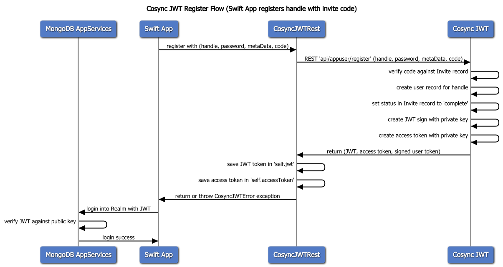

# CosyncJWTSwift

The CosyncJWTSwift package is used to add functional bindings between a Swift iOS application and the CosyncJWT service. To install this package into a Swift iOS application do the following

---

# Installation in XCode

1. In Xcode, select **File > Swift Packages > Add Package** Dependency.

2. Copy and paste the following into the search/input box, then click Next.

```
	https://github.com/Cosync/CosyncJWTSwift.git
```

3. Leave the default value of **Up to Next Major**, then click **Next**.

4. Select the Package Product; **CosyncJWTSwift**, then click **Finish**

# CosyncJWTRest class

The **CosyncJWTRest** class provides a Swift API to the REST API to the CosyncJWT service. This class is modeled on a *singleton* architecture, where is access is called through the **shared** static variable of the class. 

All Swift API functions to the CosyncJWT service are **async** functions that execute and block on the main thread. 

These async functions do not return data to the calling function, rather they set instance variable data on the **CosyncJWTRest.shared** object. All errors are handled by throwing **CosyncJWTError** exceptions from within the **async** functions. The calling code must handle these exceptions by placing the Swift function calls within a *do/catch* statement. 

The **CosyncJWTError** class includes the following enumerations:

- cosyncJWTConfiguration
- invalidAppToken
- appNoLongerExist
- appSuspended
- missingParameter
- accountSuspended
- invalidAccessToken
- appInviteNotSupported
- appSignupNotSupported
- appGoogle2FactorNotSupported
- appPhone2FactorNotSupported
- appUserPhoneNotVerified
- expiredSignupCode
- phoneNumberInUse
- appIsMirgrated
- anonymousLoginNotSupported
- internalServerError
- invalidLoginCredentials
- handleAlreadyRegistered
- invalidData
- accountDoesNotExist
- invalidMetaData
- userNameAlreadyInUse
- appIsNotSupporUserName
- userNameDoesNotExist
- accountIsNotVerify
- invalidLocale
- invalidPassword

# Function API

The CosyncJWTSwift provides a number of Swift functions 

---

## configure

The *configure()* function call is used to the CosyncJWTSwift to operate with a REST API that implements the CosyncJWT service protocol. This function should be called once at the time the application starts up.

```
	public func configure(appToken: String, cosyncRestAddress: String = "")
```

### Parameters

**appToken** : String - this contains the application token for CosyncJWT (usually retrieved from the Keys section of the Cosync Portal. 

**cosyncRestAddress** : String - this optional parameter contains the HTTPS REST API address for the CosyncJWT service. The default is 'https://sandbox.cosync.net' if not specified.

**rawPublicKey** : String - this optional parameter contains the raw Publc Key for the Cosync Application. The default is '' if not specified. This is used by the function **isValidJWT**.

For self-hosted versions of the CosyncJWT server, the **cosyncRestAddress** is the HTTPS REST API address of the self-hosted server.

This function does not throw any exceptions.

### Example

```
	CosyncJWTRest.shared.configure(appToken: Constants.APP_TOKEN,
                          cosyncRestAddress: Constants.COSYNC_REST_ADDRESS,
                               rawPublicKey: Constants.RAW_PUBLIC_KEY)
```

---

## isValidJWT

The *isValidJWT()* function is used to validate a jwt token after a call to the *login()* function. This function will only work if the **rawPublicKey** has been set as part of the configuration function.

If MongoDB App Services are not being used by the application, this function can verify that the jwt token returned by the *login()* function is valid and comes from the right provider. 

```
    public func isValidJWT() -> Bool
```

This function will return `true` if the **jwt** token is valid and signed correctly, `false` otherwise.


### Parameters

**none**

## login


The *login()* function is used to login into a user's account. If the login is successful it will return to the caller, the login credentials will be saved in member variables of the **CosyncJWTRest** shared object:

* **jwt**: the JWT token of the logged in user
* **accessToken**: the access token of the logged in user

If the application has enabled 2-factor google or phone verification, and the user has enabled 2-factor verification for his/her account, the **jwt** and **accessToken** will be set to **nil**, and the CosyncJWT service will set the following member variable in the **CosyncJWTRest** shared object:

* **loginToken**: signed login-token

This **loginToken** will be used by the *loginComplete()* function, which is passed a 2FA code sent to the user - either through the Google authenticator for Google Authentication or through Twilio for phone 2FA authentication.
```
	public func login(
		_ handle: String, 
		password: String
        ) async throws -> Void
```

If an error occurs in the call to the function, a CosyncJWTError exceptions will be thrown.


### Parameters

**handle** : String - this contains the user's user name or email. 

**password** : String - this contains the user's password.

### Example

```
	do {
		try await CosyncJWTRest.shared.login(email, password: password)
	} catch let error as CosyncJWTError {
		NSLog(@"login error '%@'", error.message)
	}
```

## loginComplete


The *loginComplete()* function is used to complete a login into a user's account with a 2FA code - provided by the Google authenticator or from a Twilio SMS message for phone 2FA verification. 

The *loginComplete()* function will use the **loginToken** saved in the **CosyncJWTRest** shared object, that was returned by the *login()* function. This **loginToken** will be matched with the *code* that is passed in. 

If the *loginComplete()* is successful it will return to the caller, the login credentials will be saved in member variables of the **CosyncJWTRest** shared object:

* **jwt**: the JWT token of the logged in user
* **accessToken**: the access token of the logged in user

```
	public func loginComplete(
		_ code: String
        ) async throws -> Void
```
If an error occurs in the call to the function, a CosyncJWTError exceptions will be thrown.

### Parameters

**code** : String - this contains the 6 digit code from the Google Authenticator or Twilio SMS

### Example

```
	do {
		try await CosyncJWTRest.shared.loginComplete(code)
	} catch let error as CosyncJWTError {
		NSLog(@"login error '%@'", error.message)
	}
```

## loginAnonymous


The *loginAnonymous()* function is used to login anonymously to the CosyncJWT system. In order to support this functionality, the developer must enable this feature from within the Cosync portal for a specific application. The advantage of anonymous login is that it does not require a user password, it also bypasses the anonymous login feature of MongoDB AppServices and creates a bonified user within Realm. Practically, this means that the anonymous user does not expire after three months. 

Each anonymous user must be given a unique handle, this is typically an application specific prefix followed by a unique UUID. This handle can be cached locally so that the anonymous user is not recreated everytime the application is activated.

If the login is successful it will return to the caller, the login credentials will be saved in member variables of the **CosyncJWTRest** shared object:

* **jwt**: the JWT token of the logged in user
* **accessToken**: the access token of the logged in user

```
	public func loginAnonymous(
		_ handle: String
        ) async throws -> Void
```

If an error occurs in the call to the function, a CosyncJWTError exceptions will be thrown.


### Parameters

**handle** : String - this contains a unique string for the anonymous user (e.g. \<prefix\>_UUID)

### Example

```
	let uuid = UUID().uuidString
	do {
		try await CosyncJWTRest.shared.loginAnonymous("testApp_" + uuid)
	} catch let error as CosyncJWTError {
		NSLog(@"login error '%@'", error.message)
	}
```

## logout

The *logout()* function is used by the client application to log out of the CosyncJWT server. This function does not actually call the server, rather it erases all the local data associated with the JWT login token. This function should be called when the user logs out.

```
	public func logout() -> Void
```

### Parameters

none

### Example

```
	CosyncJWTRest.shared.logout()
```

## signup

The *signup()* function is used to signup a user with a CosyncJWT application. This functional flow of the *signup()* function can go one of three ways, depending on the value of the signup for the application:

- none
- link
- code

If the signup flow is **none**, there is no verification of the user handle that is provided. And the flow is as follows:


If the signup flow is **link**, a web link is send to the handle (email or phone) to validate the uniqueness and authenticity of the handle. If the user clicks on the link, the handle is considered verified, and a user is created that is associated with the handle. The user must then use the **login()** function to enter the application. 


If the signup flow is **code**, a six-digit code is send to the handle (email or phone) to validate the uniqueness and authenticity of the handle. The user can then type in the code and call the function *completeSignup()* to validate the code and verify the authenticity of the user handle. 


This function may cause the CosyncJWT service to verify the handle email of the user signing up. This verification is done by either sending a six digit verification code to the handle associated with the user account if the signup flow is `code`, otherwise it sends an email link to the handle that the user can click if the signup flow is `link`. If the signup flow is `none`, no verification of the handle is required, and no call to the *completeSignup* function is required. 

Metadata associated with the user is passed in as part of the signup process in the **metadata** parameter. The metadata is passed in as JSON dictionary string. The format of the metadata is specified in the Cosync Portal for the specific application in the **JWT** tab under the *Metadata Fields* section. 

```
	public func signup(
		_ handle: String, 
		password: String, 
		metaData: String?,
        locale: String? = nil) async throws -> Void
```

If an error occurs in the call to the function, a CosyncJWTError exceptions will be thrown.

### Parameters

**handle** : String - this contains the user's handle or email. 

**password** : String - this contains the user's password.

**metadata** : String - JSON representation of the metadata.

**locale** : String - 2 letter **locale** for the user


### Example

```
	let metaData = "{\"user_data\": {\"name\": {
		\"first\": \"\(self.firstName)\", 
		\"last\": \"\(self.lastName)\"}}}"

	do {
		try await CosyncJWTRest.shared.signup(self.email, 
					password: self.password, 
					metaData: metaData)
	} catch let error as CosyncJWTError {
		NSLog(@"login error '%@'", error.message)
	}
```

## completeSignup

The *completeSignup()* function is used to complete a signup of a user with a CosyncJWT application, if the developer has selected `code` as the *signup flow* within the Cosync Portal. The *completeSignup()* function should be called after the user has been emailed a six-digit code to verify his/her email handle with CosyncJWT. This function call is not necessary if the developer has selected `link` or `none` as the signup flow for the application.

If the call to *completeSignup()* is successful, the function will call a completion function with an **error** parameter set to **nil**.

```
	public func completeSignup(
		_ handle: String, 
		code: String) async throws -> Void
```

If an error occurs in the call to the function, a CosyncJWTError exceptions will be thrown.

### Parameters

**handle** : String - this contains the user's handle or email. 

**code** : String - this contains the six-digit code sent to the user's email


### Example

```
	do {
		try await CosyncJWTRest.shared.completeSignup(self.email, code: self.code)
	} catch let error as CosyncJWTError {
		NSLog(@"login error '%@'", error.message)
	}
```

## invite


The *invite()* function is used to invite a user email into the CosyncJWT application. It is an alternative onboarding process to the *signup()* function. Invitation is done by the logged in user to another potential user's email (or phone). When a user is "invited" into a CosyncJWT application, he/she will receive and email to that effect. Similar the signup process, an invitation can also have attached metadata to it. The invited user email will be sent a six-digit code to validate the email at the time of onboarding during the "register()* function call.

Invite metadata associated with the user is passed in as part of the invite process in the **metadata** parameter. The metadata is passed in as JSON dictionary string. The format of the metadata is specified in the Cosync Portal for the specific application in the **JWT** tab under the *Invite Metadata Fields* section. The invite metadata could be used to encode a coupon value for the invited user, or any other data the developer sees fit.

The invitation process will also need to record the unique MongoDB App Services user id of the inviting user. This is stored within the *senderUserId* parameter of the *invite()* function. 

```
	public func invite(
		_ handle: String, 
		metaData: String?, 
		senderUserId: String?) async throws -> Void
```

If an error occurs in the call to the function, a CosyncJWTError exceptions will be thrown.

### Parameters

**handle** : String - this contains the user's handle or email. 

**metadata** : String - JSON representation of the invite metadata.

**senderUserId** : String - MongoDB App Services user Id of inviting user

### Example

```
	let metaData = "{\"invite_data\": {\"coupon\": \"premium\"}}"
		
	do {
		try await CosyncJWTRest.shared.invite(self.email, 
			metaData: metaData, 
			senderUserId: RealmManager.shared.app.currentUser?.id)
	} catch let error as CosyncJWTError {
		NSLog(@"login error '%@'", error.message)
	}
```

## register



The *register()* function is used to complete the invite of a user with a CosyncJWT application. When an inviting user issues a call to the *invite()* function, the invited user email will be sent an email with a six-digit code associated with the invite. This code is passed by the invited user in the *code* parameter during a call to the *register()* function.

Metadata associated with the invited user is passed in as part of the register process in the **metadata** parameter. The metadata is passed in as JSON dictionary string. This is the invited user's metadata, which is different from the *Invite Metadata* passed in by the inviting user in the *invite(()* function call. The format of the metadata is specified in the Cosync Portal for the specific application in the **JWT** tab under the *Metadata Fields* section. 

```
	public func register(
		_ handle: String, 
		password: String, 
		metaData: String?,
		code: String,
        locale: String? = nil) async throws -> Void
```

If an error occurs in the call to the function, a CosyncJWTError exceptions will be thrown.

### Parameters

**handle** : String - this contains the user's handle or email. 

**password** : String - this contains the user's password.

**metadata** : String - JSON representation of the metadata.

**locale** : String - 2 letter **locale** for the user

**code** : String - this contains the six-digit code sent to the user's email

### Example

```
	let metaData = "{\"user_data\": {\"name\": {
		\"first\": \"\(self.firstName)\", 
		\"last\": \"\(self.lastName)\"}}}"

	do {
		try await CosyncJWTRest.shared.register(self.email, 
			password: self.password, 
			metaData: metaData, 
			code: self.inviteCode)
	} catch let error as CosyncJWTError {
		NSLog(@"login error '%@'", error.message)
	}
```

## checkPassword

The *checkPassword()* function is used by the client application to check whether a password conforms to the *password filtering* parameters set for the application in the Cosync Portal. When using CosyncJWT, a developer can require that user for an application meet specific password requirements, which include:

* minimum length
* minimum upper-case letters
* minimum lower-case letters
* minimum number of digits (0…9)
* minimum special characters

The special characters include @, %, +, , /, ‘, !, #, $, ^, ?, :, (, ), [, ], ~, `, -, _, ., and ,

The *password filtering* parameters are set by the developer in the Cosync Portal, but actual password enforcement takes place at the client side. The reason for this is that passwords are sent to the CosyncJWT service as MD5 hashed strings, so there is no way to enforce this at the server level. This function is automatically called by the *signup()* function, so does not need to be called by the application code.

```
	public func checkPassword(_ password: String) -> Bool
```

### Parameters

**password** : String - this contains the user's password.

### Example

```
	if CosyncJWTRest.shared.checkPassword(self.password) {
		...
	}

```

## getUser

The *getUser()* function is used by the client application to get information about the currently logged in user to CosyncJWT. The *getUser()* function will save user information inside member variables of the **CosyncJWTRest.shared** object. These member variables include the following information:

* **handle** : String - email handle of user
* **userName** : String - user name of user
* **twoFactorPhoneVerification** : Bool - whether phone 2FA is enabled for user
* **twoFactorGoogleVerification** : Bool - whether google 2FA is enabled for user
* **appId** : String - CosyncJWT app Id for user
* **phone** : String - phone number for user in E. 164 format
* **phoneVerified** : Bool - whether user phone number has been verified
* **metaData** : String - JSON string of user metadata
* **locale** : String - user locale, e.g. 'FR'
* **lastLogin** : Date - last login date for user

```
	public func getUser() async throws -> Void
```

### Parameters

None

### Example

```
	do {
		try await CosyncJWTRest.shared.getUser()
	} catch let error as CosyncJWTError {
		NSLog(@"login error '%@'", error.message)
	}
```

## getApplication

The *getApplication()* function is used by the client application to get information about the application within CosyncJWT. The *getApplication()* function will save user information inside member variables of the **CosyncJWTRest.shared** object. These member variables include the following information:

* **appName** : String - application name as stored in CosyncJWT
* **twoFactorVerification** : String - 2FA type 'phone', 'google', or 'none'
* **passwordFilter** : Bool - whether password filtering is turned on
* **passwordMinLength** : Int - minimum password length
* **passwordMinUpper** : Int - minimum number of upper case characters
* **passwordMinLower** : Int - minimum number of lower case characters
* **passwordMinDigit** : Int - minimum number of digits
* **passwordMinSpecial** : Int - minimum number of special characters
* **appData** : Date - last login date for user

```
	public func getApplication() async throws -> Void
```

### Parameters

None

### Example

```
	do {
		try await CosyncJWTRest.shared.getApplication()
	} catch let error as CosyncJWTError {
		NSLog(@"login error '%@'", error.message)
	}
```

## setPhone

The *setPhone()* function is used by the client application to set the user's phone number, if **twoFactorVerification** for the application is set to `phone`. The phone number should be in E.164 format, and can include the prefix '+', e.g. "+19195551212". When a phone number is set, it will be initially considered unverified. After calling the *setPhone()* function, the CosyncJWT system will send a six digit code SMS to the phone for verification. The application will then have to call the *verifyPhone()* along with the six-digit code to verify the phone on behalf of the user. 

```
	public func setPhone(
		_ phoneNumber: String) async throws -> Void
```

### Parameters

**phoneNumber** : String - contains the user's phone number in E.164 format

### Example

```
	do {
		try await CosyncJWTRest.shared.setPhone(phone)
	} catch let error as CosyncJWTError {
		NSLog(@"login error '%@'", error.message)
	}
```

## verifyPhone

The *verifyPhone()* function is used by the client application to verify a user's phone number, after a call to the *setPhone()* function. The *verifyPhone()* must passed a six-digit code that was sent to the user's phone.

```
	public func verifyPhone(
		_ code: String) async throws -> Void
```

### Parameters

**code** : String - six-digit code that was sent to user's phone

### Example

```
	do {
		try await CosyncJWTRest.shared.verifyPhone(phoneCode)
	} catch let error as CosyncJWTError {
		NSLog(@"login error '%@'", error.message)
	}
```

## setTwoFactorPhoneVerification

The *setTwoFactorPhoneVerification()* function is used by the client application to enable two factor phone verification for the current logged in user. This function will only enable phone 2FA is the CosyncJWT application has **twoFactorVerification** set to `phone` and the user has a verified phone number.

```
	public func setTwoFactorPhoneVerification(
		_ twoFactor: Bool) async throws -> Void
```

### Parameters

**twoFactor** : Bool - *true* to enable phone 2FA for the user, *false* to disable it

### Example

```
	do {
		try await CosyncJWTRest.shared.setTwoFactorPhoneVerification(true)
	} catch let error as CosyncJWTError {
		NSLog(@"login error '%@'", error.message)
	}
```

## setTwoFactorGoogleVerification

The *setTwoFactorGoogleVerification()* function is used by the client application to enable two factor phone verification for the current logged in user. This function will only enable google 2FA is the CosyncJWT application has **twoFactorVerification** set to `google`. After calling this function, the user will be sent an email with a bar code for the Google Authenticator application. 

Note: The Google 2FA authentication system is more secure than simple phone 2FA, because the Google codes rotate every minute. Also, the Google 2FA authentication is free is does not require a TWILIO account for SMS phone verification.

```
	public func setTwoFactorGoogleVerification(
		_ twoFactor: Bool) async throws -> Void
```

### Parameters

**twoFactor** : Bool - *true* to enable Google 2FA for the user, *false* to disable it

### Example

```
	do {
		try await CosyncJWTRest.shared.setTwoFactorGoogleVerification(true)
	} catch let error as CosyncJWTError {
		NSLog(@"login error '%@'", error.message)
	}
```

## forgotPassword

The *forgotPassword()* function is used by the client application to enable a user to reset the password for their account. After calling this function, the user will be sent a reset password email along with a six-digit code to reset their password. The password is reset by calling the *resetPassword()* function. The user does not need to be logged in for this function to work.

```
	public func forgotPassword(
		_ handle: String) async throws -> Void
```

### Parameters

**handle** : String - email handle of the user to reset password for

### Example

```
	do {
		try await CosyncJWTRest.shared.forgotPassword(self.email)
	} catch let error as CosyncJWTError {
		NSLog(@"login error '%@'", error.message)
	}
```

## resetPassword

The *resetPassword()* function is used by the client application to reset the password for their account after issuing a *forgotPassword()* function call. The user does not need to be logged in for this function to work.


```
	public func resetPassword(
		_ handle: String, 
		password: String, 
		code: String) async throws -> Void
```

### Parameters

**handle** : String - email handle of the user to reset password for
**password** : String - new password for the account
**code** : String - code that was emailed the user by the *forgotPassword()* function


### Example

```
	do {
		try await CosyncJWTRest.shared.resetPassword(self.email,
			password: self.password, 
			code: self.code)
	} catch let error as CosyncJWTError {
		NSLog(@"login error '%@'", error.message)
	}
```

## changePassword

The *changePassword()* function is used by the client application to change the password of the current logged in user. The user must be logged in for this function to work.

```
	public func changePassword(
		_ newPassword: String, 
		password: String) async throws -> Void
```

### Parameters

**newPassword** : String - new password for the account
**password** : String - old password for the account

### Example

```
	do {
		try await CosyncJWTRest.shared.changePassword(self.newPassword, 
			password: self.password)
	} catch let error as CosyncJWTError {
		NSLog(@"login error '%@'", error.message)
	}
```

## setUserMetadata

The *setUserMetadata()* function is used by the client application to set the user metadata associated with a user account. This is the metadata that is accessible by MongoDB App Services after the user has logged into Realm. The **metaData** is a string containing JSON data.

```
	public func setUserMetadata(
		_ metaData: String) async throws -> Void
```

### Parameters

**metaData** : String - user meta data in JSON format

### Example

```
	let metaData = "{\"user_data\": {\"name\": {
		\"first\": \"\(self.firstName)\", 
		\"last\": \"\(self.lastName)\"}}}"

	do {
		try await CosyncJWTRest.shared.setUserMetadata(metaData)
	} catch let error as CosyncJWTError {
		NSLog(@"login error '%@'", error.message)
	}
```

## deleteAccount

The *deleteAccount()* function is used by the client application to delete a user account. This function will delete the user record associated with the user and free up the handle for a new account *signup()*. If the user account has a user name associatd with it, the *deleteAccount()* function can also be passed in a user name instead of the email or phone handle.

This user must be logged into for this function to work. This function is needed to support the remove account requirement on the Apple iOS Store.

```
	public func deleteAccount(
		_ handle: String, 
		password: String
        ) async throws -> Void
```

If an error occurs in the call to the function, a CosyncJWTError exceptions will be thrown.

### Parameters

**handle** : String - this contains the user's user name, email, or phone. 

**password** : String - this contains the user's password.

### Example

```
	do {
		try await CosyncJWTRest.shared.deleteAccount(email, password: password)
	} catch let error as CosyncJWTError {
		NSLog(@"login error '%@'", error.message)
	}
```

## setLocale

The *setLocale()* function is used by the client application to set the user's **locale**. The locale is a two letter code that identifies the user's locale - by default the locale is 'EN' for English. The Cosync JWT authentication system supports the ISO 631–1 codes that are described [ISO 639–1 codes](https://en.wikipedia.org/wiki/List_of_ISO_639-1_codes). Note: a client can only set the locale for a user if that locale is supported by the application in the Cosync Portal.

```
    public func setLocale(
        _ locale: String) async throws -> Void
```

### Parameters

**locale** : String - contains the user's locale (always uppercase)

### Example

```
    do {
        try await CosyncJWTRest.shared.setLocale(locale)
    } catch let error as CosyncJWTError {
        NSLog(@"login error '%@'", error.message)
    }
```

## setUserName

The *setUserName()* function is used by the client application to set the user name associated with a user account. User names must be unique names that allow the application to identify a user by something other than the email or phone handle. Typically, a user name is selected the first time a user logs in, or after he/she signs up for the first time. 

User names must consist of alphanumeric characters - starting with a letter. They are not case sensitive

```
	public func setUserName(
		_ userName: String) async throws -> Void
```
If an error occurs in the call to the function, a CosyncJWTError exceptions will be thrown.

### Parameters

**userName** : String - user name to be associated with logged in user

### Example

```
	do {
		try await CosyncJWTRest.shared.setUserName("joesmith")
	} catch let error as CosyncJWTError {
		NSLog(@"login error '%@'", error.message)
	}
```

## userNameAvailable

The *userNameAvailable()* function is used by the client application whether a user name is available and unique for the application. User names must be unique names that allow the application to identify a user by something other than the email or phone handle. 

User names must consist of alphanumeric characters - starting with a letter. They are not case sensitive

```
	public func userNameAvailable(
		_ userName: String) async throws -> Bool
```
This fuction returns **true** if user name is available, **false** otherwise. 

If an error occurs in the call to the function, a CosyncJWTError exceptions will be thrown.

### Parameters

**userName** : String - user name to be associated with logged in user

### Example

```
	do {
		let isAvailable = try await CosyncJWTRest.shared.userNameAvailable("joesmith")
		if isAvailable {
			...
		}
	} catch let error as CosyncJWTError {
		NSLog(@"login error '%@'", error.message)
	}
```

## setLocale

The *setLocale()* function is used by the client application to set the locale associated with a user account. The specified locale must be supported by the application. A user locale is a two lette code (e.g. 'FR' - for French) that identifies the user locale.

```
    public func setLocale(
        _ locale: String) async throws -> Void
```
If an error occurs in the call to the function, a CosyncJWTError exceptions will be thrown.

### Parameters

**locale** : String - locale to be associated with logged in user

### Example

```
    do {
        try await CosyncJWTRest.shared.setLocale("FR")
    } catch let error as CosyncJWTError {
        NSLog(@"login error '%@'", error.message)
    }
```


